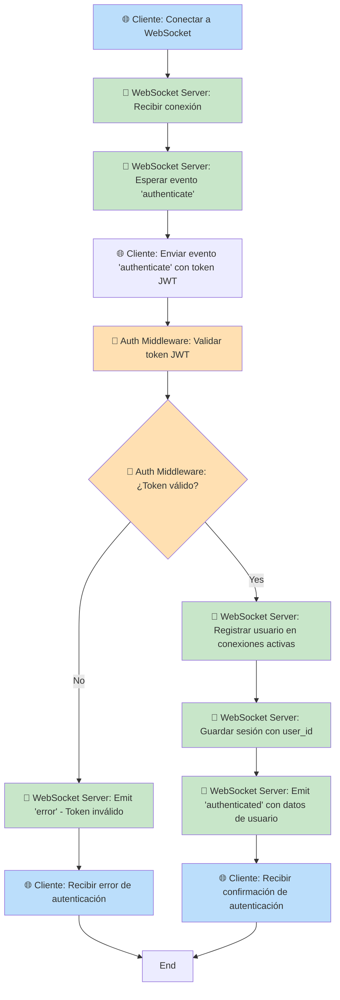
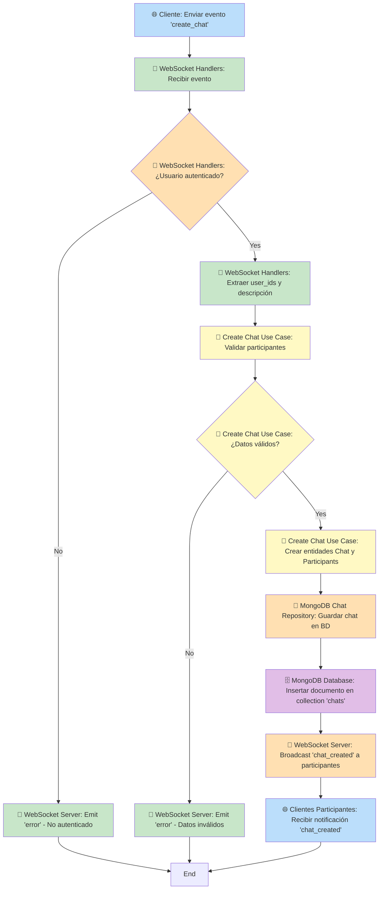
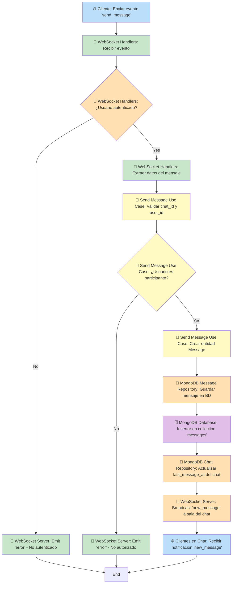
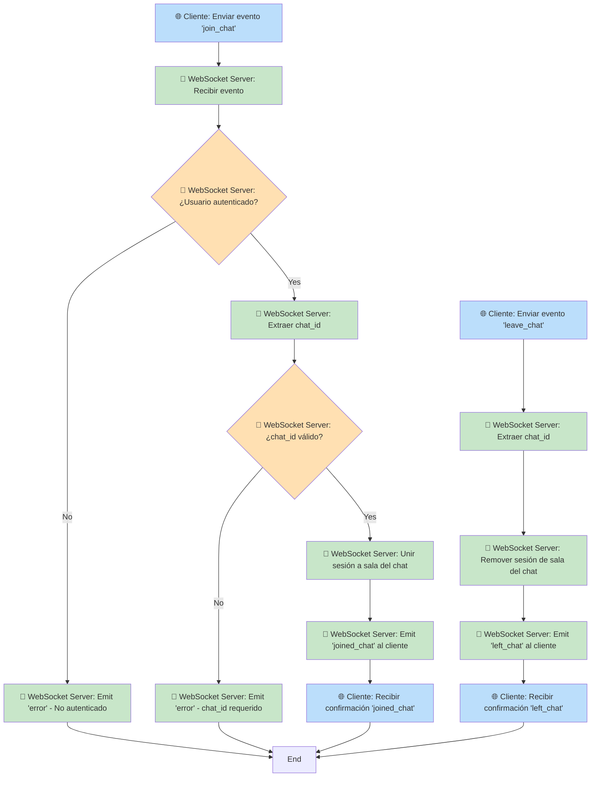
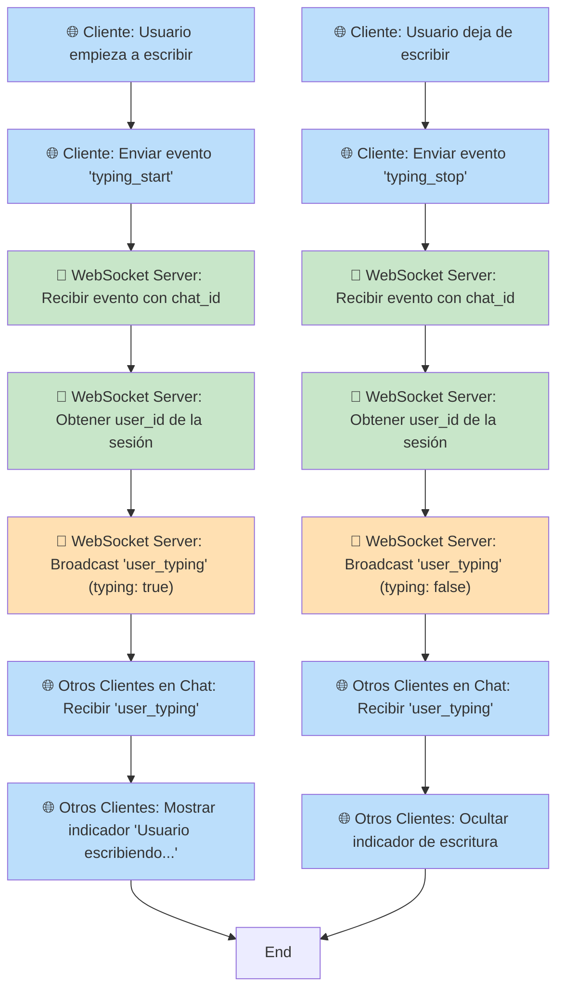

# 🚀 Online Chat Service

Un servicio de chat en tiempo real desarrollado con **FastAPI**, **Socket.IO** y **MongoDB** que permite comunicación instantánea entre usuarios a través de WebSockets con respaldo de API REST.

## 🌟 Características

- 💬 **Chat en tiempo real** con WebSocket (Socket.IO)
- 🔐 **Autenticación JWT** para seguridad
- 📊 **API REST** completa para integraciones
- 🗄️ **MongoDB** para persistencia de datos
- 📱 **Cliente web de ejemplo** incluido
- 🟢 **Indicadores de escritura** en tiempo real
- 🔄 **Estados de mensajes** (enviado, entregado, leído)
- 👥 **Chats grupales** e individuales
- 🔌 **Conexiones múltiples** por usuario

## 🏗️ Arquitectura del Sistema

El proyecto sigue una **arquitectura hexagonal (Clean Architecture)** que separa las responsabilidades en capas bien definidas. A continuación se muestran los diagramas de flujo para cada funcionalidad principal:

### 🎨 Código de Colores por Capas

- **🔵 Azul Claro**: Capa de Cliente/Presentación
- **🟢 Verde Claro**: Capa de Controladores/API
- **🟡 Amarillo Claro**: Capa de Aplicación (Casos de Uso)
- **🟠 Naranja Claro**: Capa de Infraestructura
- **🟣 Morado Claro**: Capa de Base de Datos

---

### 🔐 1. Autenticación WebSocket



---

### 💬 2. Creación de Chats



---

### 📨 3. Envío de Mensajes



---

### 🏠 4. Gestión de Salas de Chat



---

### ⌨️ 5. Indicadores de Escritura



---

### 📋 Componentes Principales

1. **Cliente**: Aplicaciones web/mobile que consumen la API
2. **FastAPI Server**: Servidor principal que maneja HTTP y WebSocket
3. **Auth Middleware**: Validación de tokens JWT
4. **Use Cases**: Lógica de negocio (crear chat, enviar mensaje, etc.)
5. **Repositories**: Abstracción de acceso a datos
6. **MongoDB**: Base de datos de persistencia
7. **WebSocket Server**: Comunicación en tiempo real

## 🚀 Instalación Rápida

### 1. Requisitos Previos

- **Python 3.8+**
- **MongoDB** (local o remoto)
- **Git**

### 2. Configuración del Proyecto

```bash
# Clonar el repositorio
git clone <tu-repo-url>
cd OnlineChatService

# Crear entorno virtual
python -m venv venv

# Activar entorno virtual
# Windows:
venv\Scripts\activate
# macOS/Linux:
source venv/bin/activate

# Instalar dependencias
pip install -r requirements.txt
```

### 3. Configuración de MongoDB

```bash
# Asegúrate de tener MongoDB corriendo
# Por defecto se conecta a: mongodb://localhost:27017/chatservice
```

### 4. Ejecutar el Servidor

```bash
python main.py
```

El servidor estará disponible en: `http://localhost:8000`

## 📋 Flujo de Conexión Completo

### 🔑 1. Autenticación

#### Opción A: Usando el Cliente de Ejemplo

1. **Abrir el cliente**: Ve a `http://localhost:8000/client_example.html`
2. **Token de prueba**: Usa el token preconfigurado o genera uno nuevo
3. **Conectar**: Haz clic en "Autenticar"

#### Opción B: Generar Token JWT

```python
# Usar generate_test_tokens.py para crear tokens de prueba
python generate_test_tokens.py
```

#### Opción C: Crear Token Manualmente

```python
import jwt

# Crear token JWT
payload = {
    "user_id": "tu_usuario_id",
    "name": "Tu Nombre"
}

token = jwt.encode(payload, "tu_secret_key", algorithm="HS256")
```

### 🌐 2. Conexión WebSocket

```javascript
// 1. Conectar al servidor Socket.IO
const socket = io('http://localhost:8000');

// 2. Manejar conexión exitosa
socket.on('connect', () => {
    console.log('✅ Conectado al servidor');
});

// 3. Autenticarse
socket.emit('authenticate', {
    token: 'tu_jwt_token_aqui'
});

// 4. Confirmar autenticación
socket.on('authenticated', (data) => {
    console.log('✅ Autenticado como:', data.user_id);
});
```

### 💬 3. Crear y Unirse a Chats

```javascript
// Crear nuevo chat
socket.emit('create_chat', {
    user_ids: ['user1', 'user2', 'user3'],
    description: 'Chat grupal de trabajo'
});

// Escuchar confirmación
socket.on('chat_created', (data) => {
    console.log('✅ Chat creado:', data.id);
    
    // Unirse automáticamente al chat
    socket.emit('join_chat', {
        chat_id: data.id
    });
});

// Confirmar que te uniste
socket.on('joined_chat', (data) => {
    console.log('✅ Unido al chat:', data.chat_id);
});
```

### 📨 4. Enviar y Recibir Mensajes

```javascript
// Enviar mensaje
socket.emit('send_message', {
    chat_id: 'chat_id_aqui',
    user_id: 'tu_user_id',
    content: '¡Hola mundo!',
    type: 'text'
});

// Recibir mensajes nuevos
socket.on('new_message', (message) => {
    console.log('📨 Nuevo mensaje:', message);
    // message contiene: id, chat_id, sender_id, content, sent_at, etc.
});
```

### ⌨️ 5. Indicadores de Escritura

```javascript
// Indicar que empezaste a escribir
socket.emit('typing_start', {
    chat_id: 'chat_id_aqui'
});

// Indicar que dejaste de escribir
socket.emit('typing_stop', {
    chat_id: 'chat_id_aqui'
});

// Escuchar cuando otros escriben
socket.on('user_typing', (data) => {
    if (data.typing) {
        console.log(`${data.user_id} está escribiendo...`);
    } else {
        console.log(`${data.user_id} dejó de escribir`);
    }
});
```

## 🔌 API REST Endpoints

### Autenticación

Todos los endpoints REST requieren autenticación JWT en el header:

```http
Authorization: Bearer tu_jwt_token_aqui
```

### Endpoints Disponibles

#### 📊 Información General

```http
GET /                    # Información de la API
GET /health             # Estado del servicio
GET /api/stats          # Estadísticas del sistema
```

#### 💬 Gestión de Chats

```http
# Crear chat
POST /api/chats
Content-Type: application/json

{
    "user_ids": ["user1", "user2"],
    "description": "Chat de trabajo"
}

# Obtener chats del usuario
GET /api/users/{user_id}/chats

# Obtener mensajes de un chat
GET /api/chats/{chat_id}/messages?limit=50
```

#### 📨 Envío de Mensajes

```http
POST /api/messages
Content-Type: application/json

{
    "chat_id": "chat_id_aqui",
    "user_id": "tu_user_id",
    "content": "Mi mensaje",
    "type": "text",
    "attachments": []
}
```

## 🎯 Ejemplo Completo de Uso

### Cliente JavaScript

```html
<!DOCTYPE html>
<html>
<head>
    <script src="https://cdn.socket.io/4.7.2/socket.io.min.js"></script>
</head>
<body>
    <script>
        // 1. Conectar
        const socket = io('http://localhost:8000');
        
        // 2. Autenticar
        socket.on('connect', () => {
            socket.emit('authenticate', {
                token: 'eyJhbGciOiJIUzI1NiIsInR5cCI6IkpXVCJ9.eyJ1c2VyX2lkIjoidXNlcjEiLCJuYW1lIjoiVXN1YXJpbyBEZSBQcnVlYmEifQ.test'
            });
        });
        
        // 3. Configurar eventos
        socket.on('authenticated', (data) => {
            console.log('Autenticado:', data.user_id);
            
            // Crear chat
            socket.emit('create_chat', {
                user_ids: ['user1', 'user2'],
                description: 'Mi primer chat'
            });
        });
        
        socket.on('chat_created', (data) => {
            console.log('Chat creado:', data.id);
            
            // Unirse al chat
            socket.emit('join_chat', { chat_id: data.id });
        });
        
        socket.on('joined_chat', (data) => {
            console.log('Unido al chat:', data.chat_id);
            
            // Enviar mensaje
            socket.emit('send_message', {
                chat_id: data.chat_id,
                user_id: 'user1',
                content: '¡Hola desde JavaScript!',
                type: 'text'
            });
        });
        
        socket.on('new_message', (message) => {
            console.log('Nuevo mensaje:', message);
        });
        
        socket.on('error', (error) => {
            console.error('Error:', error);
        });
    </script>
</body>
</html>
```

### Cliente Python

```python
import socketio
import asyncio

# Crear cliente Socket.IO
sio = socketio.AsyncClient()

@sio.event
async def connect():
    print('✅ Conectado al servidor')
    
    # Autenticarse
    await sio.emit('authenticate', {
        'token': 'tu_jwt_token_aqui'
    })

@sio.event
async def authenticated(data):
    print(f'✅ Autenticado como: {data["user_id"]}')
    
    # Crear chat
    await sio.emit('create_chat', {
        'user_ids': ['user1', 'user2'],
        'description': 'Chat desde Python'
    })

@sio.event
async def chat_created(data):
    chat_id = data['id']
    print(f'✅ Chat creado: {chat_id}')
    
    # Unirse al chat
    await sio.emit('join_chat', {'chat_id': chat_id})

@sio.event
async def joined_chat(data):
    chat_id = data['chat_id']
    print(f'✅ Unido al chat: {chat_id}')
    
    # Enviar mensaje
    await sio.emit('send_message', {
        'chat_id': chat_id,
        'user_id': 'user1',
        'content': '¡Hola desde Python!',
        'type': 'text'
    })

@sio.event
async def new_message(data):
    print(f'📨 Nuevo mensaje: {data}')

@sio.event
async def error(data):
    print(f'❌ Error: {data}')

# Ejecutar cliente
async def main():
    await sio.connect('http://localhost:8000')
    await sio.wait()

if __name__ == '__main__':
    asyncio.run(main())
```

## 🏗️ Estructura del Proyecto

```
OnlineChatService/
├── domain/                    # Lógica de negocio
│   ├── entities/             # Entidades del dominio
│   │   ├── chat.py          # Entidad Chat
│   │   ├── message.py       # Entidad Message
│   │   └── participant.py   # Entidad Participant
│   └── ports/               # Interfaces
│       ├── input/           # Casos de uso
│       └── output/          # Repositorios
├── application/             # Casos de uso
│   └── use_cases/
│       ├── create_chat_use_case.py
│       ├── send_message_use_case.py
│       └── get_chats_use_case.py
├── infrastructure/          # Implementaciones
│   ├── auth/               # Autenticación
│   ├── database/           # Configuración BD
│   ├── repositories/       # Repositorios MongoDB
│   └── websocket/          # Servidor WebSocket
├── main.py                 # Punto de entrada
└── client_example.html     # Cliente de ejemplo
```

## 🔧 Eventos WebSocket Disponibles

### 📤 Eventos que Puedes Enviar

| Evento | Descripción | Parámetros |
|--------|-------------|------------|
| `authenticate` | Autenticarse con JWT | `{token: string}` |
| `create_chat` | Crear nuevo chat | `{user_ids: string[], description?: string}` |
| `join_chat` | Unirse a un chat | `{chat_id: string}` |
| `leave_chat` | Salir de un chat | `{chat_id: string}` |
| `send_message` | Enviar mensaje | `{chat_id: string, user_id: string, content: string, type: string}` |
| `get_user_chats` | Obtener chats del usuario | `{user_id: string}` |
| `get_chat_messages` | Obtener mensajes del chat | `{chat_id: string, limit?: number}` |
| `typing_start` | Empezar a escribir | `{chat_id: string}` |
| `typing_stop` | Dejar de escribir | `{chat_id: string}` |

### 📥 Eventos que Puedes Recibir

| Evento | Descripción | Datos |
|--------|-------------|-------|
| `connect` | Conectado al servidor | - |
| `disconnect` | Desconectado del servidor | - |
| `authenticated` | Autenticación exitosa | `{user_id: string, user_data: object}` |
| `chat_created` | Chat creado | `{id: string, type: string, participants: array}` |
| `joined_chat` | Unido al chat | `{chat_id: string}` |
| `left_chat` | Salió del chat | `{chat_id: string}` |
| `new_message` | Nuevo mensaje | `{id: string, chat_id: string, sender_id: string, content: string, ...}` |
| `user_chats` | Lista de chats del usuario | `{chats: array}` |
| `chat_messages` | Mensajes del chat | `{messages: array}` |
| `user_typing` | Usuario escribiendo | `{user_id: string, chat_id: string, typing: boolean}` |
| `error` | Error ocurrido | `{message: string, details?: string}` |

## 🛠️ Troubleshooting

### Problemas Comunes

#### 1. No se puede conectar al servidor

```bash
# Verificar que el servidor esté corriendo
curl http://localhost:8000/health

# Verificar que MongoDB esté activo
mongosh --eval "db.runCommand({ping: 1})"
```

#### 2. Error de autenticación

```javascript
// Verificar que el token sea válido
socket.on('error', (error) => {
    console.error('Error de autenticación:', error);
    // Renovar token o verificar formato
});
```

#### 3. Mensajes no llegan

```javascript
// Verificar que estés unido al chat
socket.emit('join_chat', { chat_id: 'tu_chat_id' });

// Verificar eventos de error
socket.on('error', console.error);
```

### Logs Útiles

```bash
# Ver logs del servidor
python main.py  # Los logs aparecen en consola

# Verificar conexiones activas
curl http://localhost:8000/api/stats
```

## 🔐 Seguridad

- **JWT Tokens**: Todos los usuarios deben autenticarse
- **Validación**: Usuarios solo pueden ver sus propios chats
- **CORS**: Configurado para desarrollo (ajustar para producción)
- **Sanitización**: Los mensajes son validados antes de guardar

## 📚 Próximos Pasos

1. **Personalizar autenticación**: Integrar con tu sistema de usuarios
2. **Configurar MongoDB**: Usar instancia en producción
3. **Añadir archivos**: Implementar sistema de attachments
4. **Notificaciones**: Agregar notificaciones push
5. **Escalabilidad**: Implementar Redis para múltiples instancias

## 🤝 Contribuir

1. Fork el proyecto
2. Crea una rama para tu feature
3. Commit tus cambios
4. Push a la rama
5. Abre un Pull Request

¡Disfruta construyendo tu sistema de chat! 🚀💬